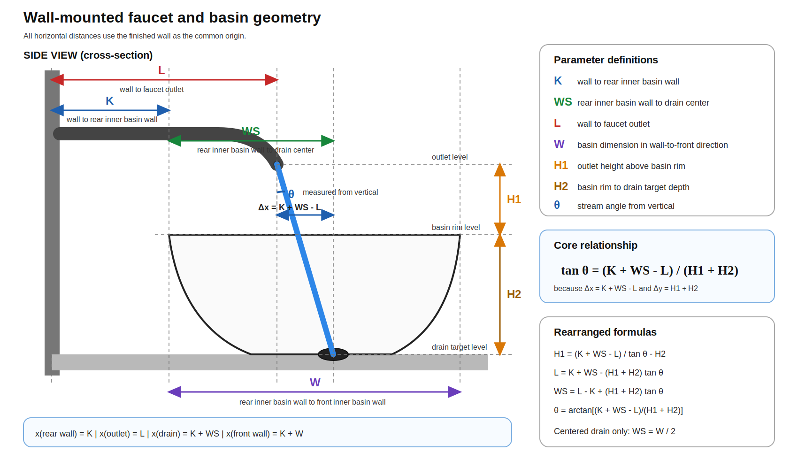

# Wall-Mounted Faucet Geometry Skill

Language: [English](README.md) | [中文](README.zh-CN.md)

Calculate the straight-line geometric relationship among a wall-mounted faucet outlet, basin rim, drain target point, and water stream angle.



## Installation

This repository is a filesystem skill package. The install folder should be named `wall-mounted-faucet-layout`, because that is the skill name in `SKILL.md`.

### Codex / OpenAI-style skills

Install as a user skill:

```bash
mkdir -p ~/.codex/skills
git clone https://github.com/starsy/wall-mounted-faucet-layout-skill.git ~/.codex/skills/wall-mounted-faucet-layout
```

### Claude / Claude Code

For Claude surfaces that support local skill folders:

```bash
mkdir -p ~/.claude/skills
git clone https://github.com/starsy/wall-mounted-faucet-layout-skill.git ~/.claude/skills/wall-mounted-faucet-layout
```

For Claude surfaces that import skills as archives, clone the repo, zip the `wall-mounted-faucet-layout` folder, and import that ZIP in the Skills UI.

### OpenClaw

Install globally for OpenClaw agents:

```bash
mkdir -p ~/.openclaw/skills
git clone https://github.com/starsy/wall-mounted-faucet-layout-skill.git ~/.openclaw/skills/wall-mounted-faucet-layout
```

For workspace-scoped OpenClaw installs, clone the same folder into that workspace's skills directory if your OpenClaw setup uses one.

### Cursor and other rule/context-based agents

If the agent does not auto-discover `SKILL.md` packages, clone this repo into a stable project path and point the agent's rule/context system at `SKILL.md`.

```bash
mkdir -p vendor/skills
git clone https://github.com/starsy/wall-mounted-faucet-layout-skill.git vendor/skills/wall-mounted-faucet-layout
```

For Cursor, add a project rule such as `.cursor/rules/wall-mounted-faucet-layout.mdc`:

```md
---
description: Use wall-mounted faucet geometry calculations
alwaysApply: false
---

When asked about wall-mounted faucet installation geometry, read and follow
`vendor/skills/wall-mounted-faucet-layout/SKILL.md`. Prefer the deterministic
calculator at `vendor/skills/wall-mounted-faucet-layout/scripts/faucet_geometry.py`.
```

Use it from an agent prompt:

```text
Use $wall-mounted-faucet-layout to solve faucet reach L with K=5 cm, WS=20 cm, H1=15 cm, H2=14 cm, and theta=10 degrees.
```

## Most Common Workflows

Most faucet-selection questions come down to `L` or `H1`:

- Solve `L` to find the faucet reach/spec-sheet projection needed for a planned outlet height.
- Solve `H1` to check the required outlet height when you already have a candidate faucet reach.

### Choose faucet reach: solve `L`

Use this when the basin/drain geometry and desired outlet height are known:

```bash
python scripts/faucet_geometry.py \
  --solve L \
  --K 5 \
  --WS 20 \
  --H1 15 \
  --H2 14 \
  --theta 10 \
  --unit cm
```

Expected result:

```text
L = 19.9 cm
horizontal_offset = 5.1 cm
vertical_drop = 29.0 cm
reverse_theta = 10.0 degrees
```

Interpretation: choose a faucet whose outlet projects about `19.9 cm` from the finished wall.

### Check outlet height: solve `H1`

Use this when you already know the faucet reach:

```bash
python scripts/faucet_geometry.py \
  --solve H1 \
  --K 5 \
  --W 40 \
  --H2 14 \
  --L 20.5 \
  --theta 10 \
  --unit cm
```

Expected result:

```text
H1 = 11.5 cm
horizontal_offset = 4.5 cm
vertical_drop = 25.5 cm
reverse_theta = 10.0 degrees
drain_center_offset = 0.0 cm
```

Interpretation: this reach works geometrically if the outlet can sit about `11.5 cm` above the basin rim.

Files:

- `SKILL.md` — formulas, workflow, validation, and examples
- `agents/openai.yaml` — optional UI metadata for agents that support it
- `scripts/faucet_geometry.py` — deterministic calculator
- `scripts/render_geometry_svg.py` — custom annotated SVG renderer for a specific input/result
- `assets/wall_mounted_faucet_geometry_v2.svg` — scalable diagram for GitHub
- `assets/wall_mounted_faucet_geometry_v2.png` — raster fallback of the same diagram

Core relationship:

```text
tan(theta) = (K + WS - L) / (H1 + H2)
```

Use the SVG in rendered documentation because it stays crisp when zoomed and keeps the parameter labels readable.

The script prints practical metric precision by default: whole millimeters for `--unit mm`, `0.1 cm` for `--unit cm`, and `0.1°` for angles. Use `--precision` or `--angle-precision` to override display precision.

## Generate an Annotated SVG

Use the renderer when you want a visual handoff for a specific faucet setup. It solves the same geometry as the calculator, then writes an SVG with `K`, `WS`, `L`, `H1`, `H2`, `theta`, horizontal offset, and the solved result marked directly on the diagram.

```bash
python scripts/render_geometry_svg.py \
  --solve L \
  --K 5 \
  --WS 20 \
  --H1 15 \
  --H2 14 \
  --theta 10 \
  --unit cm \
  --output faucet-layout.svg
```

The generated SVG is intended for sharing with installers or clients before doing the final on-site water-flow test.

Secondary example: solve drain position `WS`

```bash
python scripts/faucet_geometry.py \
  --solve WS \
  --K 5 \
  --H1 15 \
  --H2 14 \
  --L 20.5 \
  --theta 10 \
  --W 40 \
  --unit cm
```

Expected result:

```text
WS = 20.6 cm
horizontal_offset = 5.1 cm
vertical_drop = 29.0 cm
reverse_theta = 10.0 degrees
drain_center_offset = 0.6 cm
```

This calculator is a geometric estimate. Confirm the final installation with an on-site mock-up or water-flow test before closing the wall.
