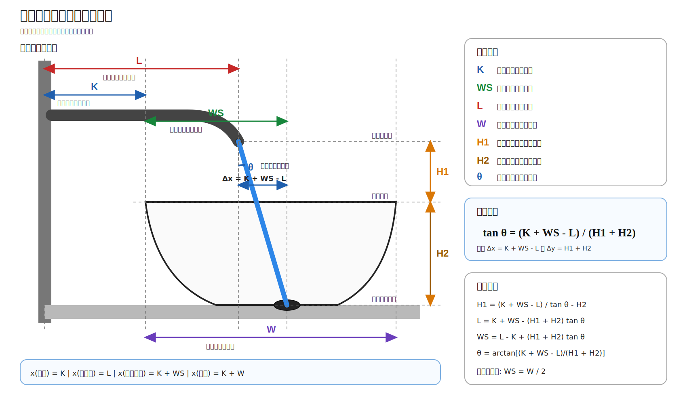

# 壁挂式龙头几何安装计算 Skill

语言: [English](README.md) | [中文](README.zh-CN.md)

用于计算壁挂式龙头出水口、台盆盆沿、排水目标点和水流角度之间的直线几何关系。



## 安装

这个仓库是一个文件系统形式的 skill package。安装目录应命名为 `wall-mounted-faucet-layout`，因为这是 `SKILL.md` 中声明的 skill 名称。

### Codex / OpenAI 风格 skills

安装为用户级 skill:

```bash
mkdir -p ~/.codex/skills
git clone https://github.com/starsy/wall-mounted-faucet-layout-skill.git ~/.codex/skills/wall-mounted-faucet-layout
```

### Claude / Claude Code

如果你的 Claude 运行环境支持本地 skill 目录:

```bash
mkdir -p ~/.claude/skills
git clone https://github.com/starsy/wall-mounted-faucet-layout-skill.git ~/.claude/skills/wall-mounted-faucet-layout
```

如果你的 Claude 运行环境通过压缩包导入 Skills，请先 clone 该仓库，把 `wall-mounted-faucet-layout` 文件夹压缩成 ZIP，然后在 Skills UI 中导入该 ZIP。

### OpenClaw

安装为 OpenClaw 全局 skill:

```bash
mkdir -p ~/.openclaw/skills
git clone https://github.com/starsy/wall-mounted-faucet-layout-skill.git ~/.openclaw/skills/wall-mounted-faucet-layout
```

如果你的 OpenClaw 配置使用工作区级 skills 目录，也可以把同名文件夹 clone 到该工作区的 skills 目录中。

### Cursor 和其他基于规则/上下文的 agents

如果 agent 不会自动发现 `SKILL.md` package，可以把该仓库 clone 到项目中的固定位置，然后让 agent 的规则或上下文系统引用 `SKILL.md`。

```bash
mkdir -p vendor/skills
git clone https://github.com/starsy/wall-mounted-faucet-layout-skill.git vendor/skills/wall-mounted-faucet-layout
```

对于 Cursor，可以添加类似 `.cursor/rules/wall-mounted-faucet-layout.mdc` 的项目规则:

```md
---
description: Use wall-mounted faucet geometry calculations
alwaysApply: false
---

When asked about wall-mounted faucet installation geometry, read and follow
`vendor/skills/wall-mounted-faucet-layout/SKILL.md`. Prefer the deterministic
calculator at `vendor/skills/wall-mounted-faucet-layout/scripts/faucet_geometry.py`.
```

在 agent 提示中使用:

```text
Use $wall-mounted-faucet-layout to solve faucet reach L with K=5 cm, WS=20 cm, H1=15 cm, H2=14 cm, and theta=10 degrees.
```

## 最常见工作流

选择壁挂式龙头时，通常最需要计算的是 `L` 或 `H1`：

- 计算 `L`：在台盆/排水几何和期望出水口高度已知时，用来选择龙头出水口伸出墙面的距离。
- 计算 `H1`：在已经看中某个龙头、已知龙头伸出距离 `L` 时，用来检查出水口应高出盆沿多少。

### 选择龙头伸出距离：计算 `L`

当台盆/排水几何和期望出水口高度已知时使用:

```bash
python scripts/faucet_geometry.py \
  --solve L \
  --K 5 \
  --WS 20 \
  --H1 15 \
  --H2 14 \
  --theta 10 \
  --unit cm
```

期望结果:

```text
L = 19.9 cm
horizontal_offset = 5.1 cm
vertical_drop = 29.0 cm
reverse_theta = 10.0 degrees
```

解释：选择出水口从完成墙面伸出约 `19.9 cm` 的龙头。

### 检查出水口高度：计算 `H1`

当已经知道龙头伸出距离时使用:

```bash
python scripts/faucet_geometry.py \
  --solve H1 \
  --K 5 \
  --W 40 \
  --H2 14 \
  --L 20.5 \
  --theta 10 \
  --unit cm
```

期望结果:

```text
H1 = 11.5 cm
horizontal_offset = 4.5 cm
vertical_drop = 25.5 cm
reverse_theta = 10.0 degrees
drain_center_offset = 0.0 cm
```

解释：如果出水口能高出盆沿约 `11.5 cm`，这个龙头伸出距离在几何上可行。

文件:

- `SKILL.md` - 公式、工作流程、校验规则和示例
- `agents/openai.yaml` - 供支持该元数据的 agent 使用的可选 UI 信息
- `scripts/faucet_geometry.py` - 确定性的计算脚本
- `scripts/render_geometry_svg.py` - 根据具体输入和结果生成带标注的 SVG 示意图
- `assets/wall_mounted_faucet_geometry_v2_zh.svg` - 中文 README 使用的可缩放示意图
- `assets/wall_mounted_faucet_geometry_v2_zh.png` - 中文示意图的栅格备用版本
- `assets/wall_mounted_faucet_geometry_v2.svg` - 英文版可缩放示意图
- `assets/wall_mounted_faucet_geometry_v2.png` - 英文版栅格备用版本

核心关系:

```text
tan(theta) = (K + WS - L) / (H1 + H2)
```

渲染文档时建议优先使用 SVG，因为缩放后标签仍然清晰；PNG 仅作为不支持 SVG 的环境中的备用图。

脚本默认输出适合现场安装的工程精度：`--unit mm` 时输出到整毫米，`--unit cm` 时输出到 `0.1 cm`，角度输出到 `0.1°`。如需调整显示精度，可使用 `--precision` 或 `--angle-precision`。

## 生成带标注的 SVG

当需要把具体安装方案可视化交给安装人员或客户确认时，可以使用渲染脚本。它会使用和计算器相同的几何关系，并在 SVG 图中直接标出 `K`、`WS`、`L`、`H1`、`H2`、`theta`、水平偏移量和计算结果。

```bash
python scripts/render_geometry_svg.py \
  --solve L \
  --K 5 \
  --WS 20 \
  --H1 15 \
  --H2 14 \
  --theta 10 \
  --unit cm \
  --output faucet-layout.svg
```

生成的 SVG 适合在最终现场放水测试前用于沟通和确认。

次要示例：计算排水位置 `WS`

```bash
python scripts/faucet_geometry.py \
  --solve WS \
  --K 5 \
  --H1 15 \
  --H2 14 \
  --L 20.5 \
  --theta 10 \
  --W 40 \
  --unit cm
```

期望结果:

```text
WS = 20.6 cm
horizontal_offset = 5.1 cm
vertical_drop = 29.0 cm
reverse_theta = 10.0 degrees
drain_center_offset = 0.6 cm
```

该计算器提供的是几何估算。封墙前请使用现场样板或实际放水测试确认最终安装位置。
